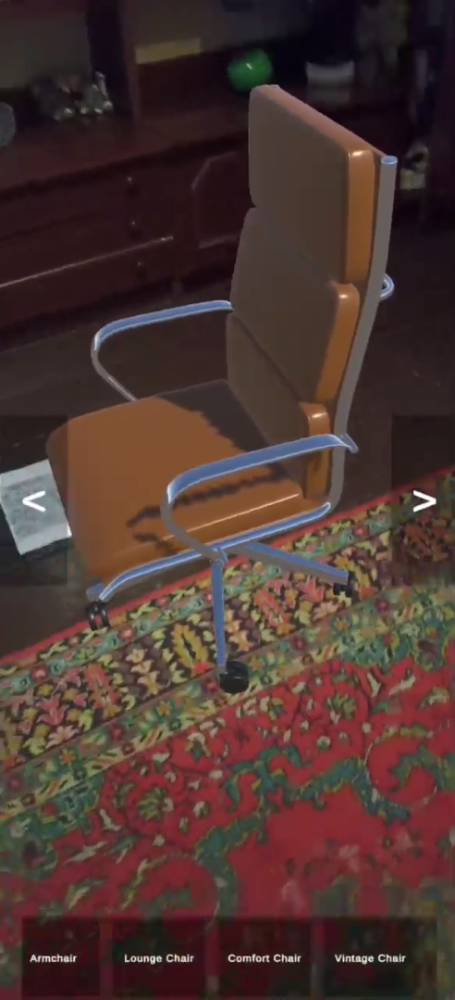
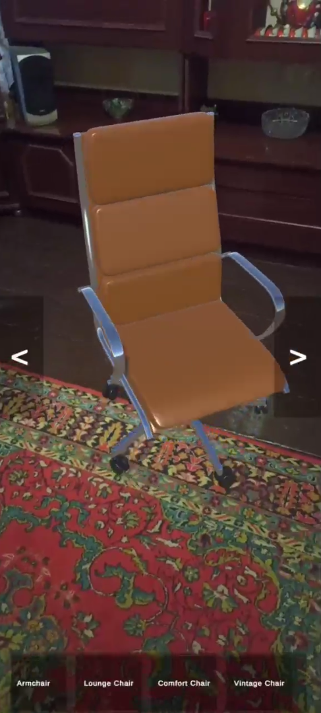
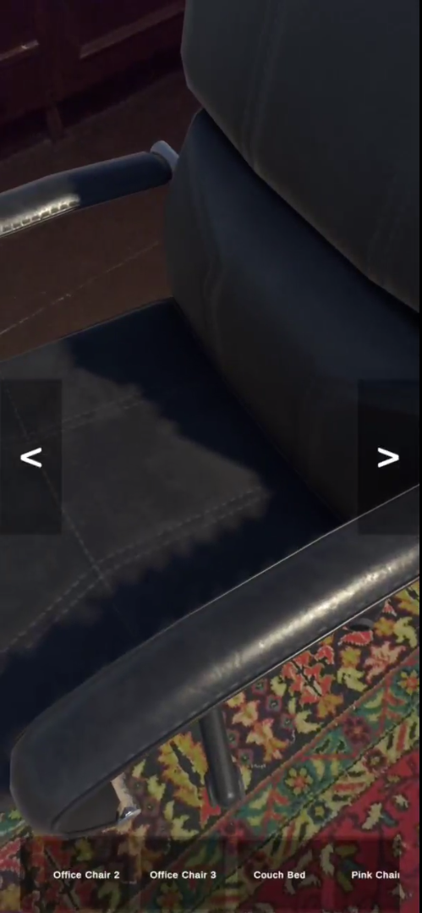
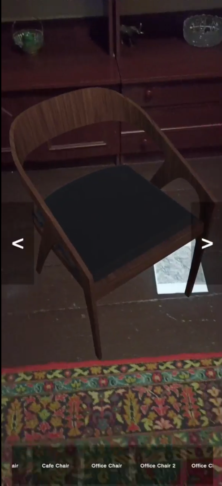
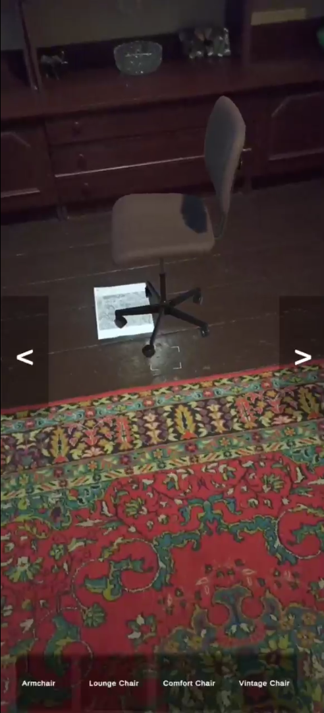
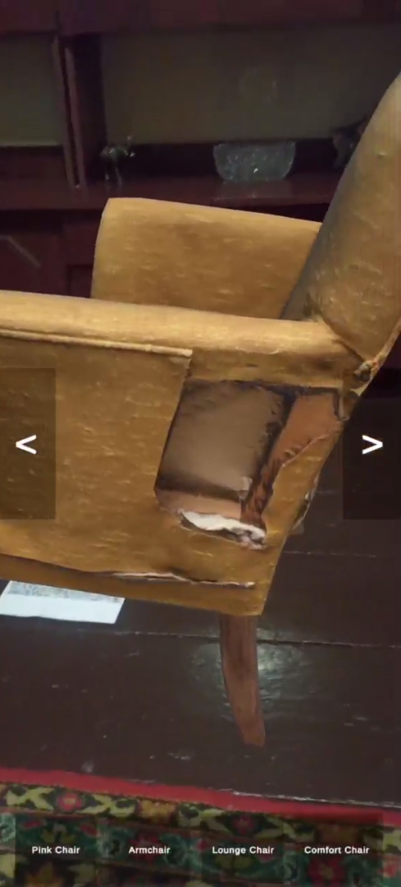
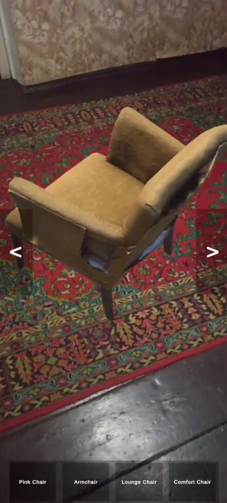

# AR Furniture Placement App

## 🚀 Demo

🎥 **Watch the trailer:** [Trailer](https://drive.google.com/drive/u/1/folders/1XNxFAU2MVP9xlxkR33ZGKnFlkdyRVwk0)

📦 **Завантажити APK:** [ARFurniturePlacement.apk](https://example.com/ARFurniturePlacement.apk)

## 👨‍💻 Виконавці

- Прасол Нікіта  
- Ткачук Нікіта  
- Група: КН-22-3

## ℹ Важливо

Для правильного визначення рівня підлоги в режимі емуляції потрібно надрукувати файл [Emulator Ground Plane](emulator_ground_plane.pdf) та розмістити його на підлогу в зоні камери. Це дозволить програмі правильно орієнтуватися в просторі та точно розміщувати меблі.

## 📸 Скріншоти

